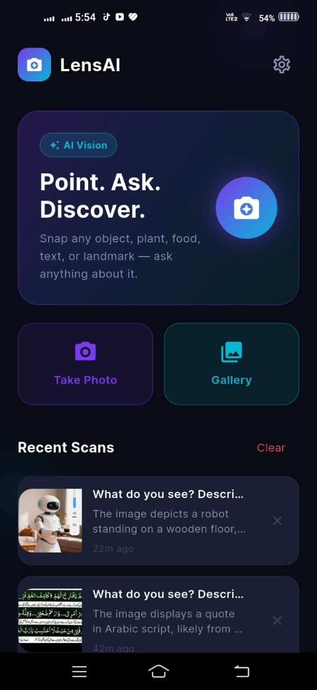
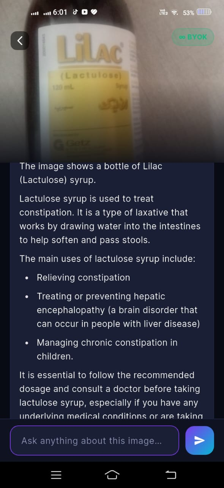
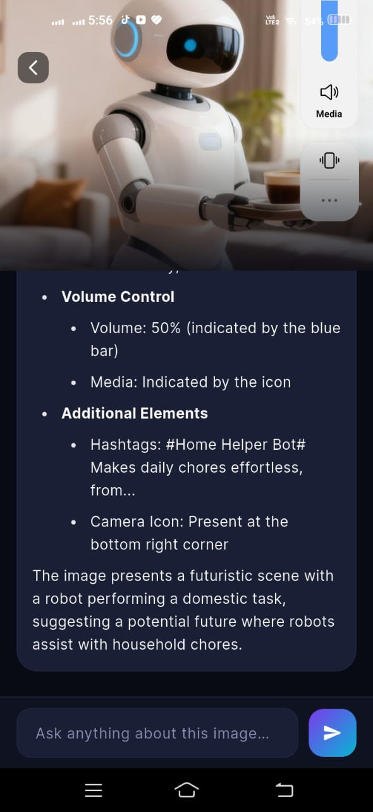
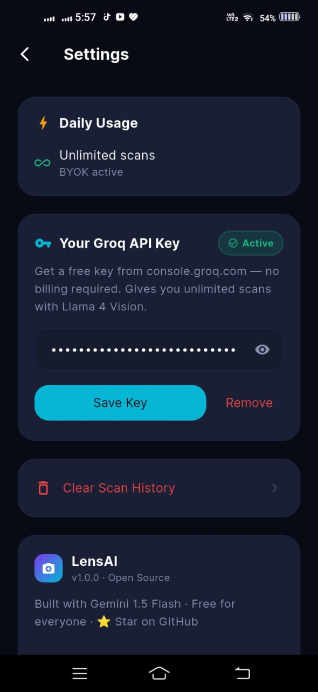

<div align="center">

# 📸 PhotoGPT
### Stop Googling. Just point your camera.

**The AI camera that answers everything — free for everyone, forever.**

[](https://chupamobiles-bot.github.io/PhotoGPT)
[](https://github.com/chupamobiles-bot/PhotoGPT/releases/latest)
[](https://github.com/chupamobiles-bot/PhotoGPT/stargazers)
[](LICENSE)

<br/>

**No login. No subscription. No API key needed to start.**
5 free scans/day · Add your own key for unlimited · 100% open source

</div>

---

## ✨ What can it do?

Snap a photo of **literally anything** and ask in plain English:

| 📸 You photograph... | 💬 You ask... | 🤖 AI answers... |
|---|---|---|
| Food on your plate | "How many calories?" | Full nutrition breakdown |
| A plant or flower | "Is this toxic to cats?" | Safety + plant name |
| Medicine bottle | "What are the side effects?" | Clear explanation |
| Math problem | "Solve this step by step" | Complete solution |
| Restaurant menu | "Translate this to English" | Full translation |
| Error on screen | "What does this error mean?" | Fix + explanation |
| Product label | "Are these ingredients halal?" | Ingredient analysis |
| Broken device | "What's wrong here?" | Diagnosis |

---

## 🚀 Try It Right Now

**Option 1 — Web (no install):**
👉 **[chupamobiles-bot.github.io/PhotoGPT](https://chupamobiles-bot.github.io/PhotoGPT)** — works on any phone browser, camera included

**Option 2 — Android APK:**
👉 **[Download latest APK](https://github.com/chupamobiles-bot/PhotoGPT/releases/latest)** — 18MB, sideload in 30 seconds

**Option 3 — Build yourself:**
```bash
git clone https://github.com/chupamobiles-bot/PhotoGPT
cd PhotoGPT && flutter pub get && flutter run
```

---

## 📱 Screenshots

<div align="center">
<table>
<tr>
<td align="center"><b>🏠 Home</b></td>
<td align="center"><b>🤖 AI Analysis</b></td>
<td align="center"><b>💬 Follow-up Chat</b></td>
<td align="center"><b>⚙️ Settings</b></td>
</tr>
<tr>
<td></td>
<td></td>
<td></td>
<td></td>
</tr>
</table>
</div>

---

## 🔑 Getting Your Free API Key

PhotoGPT uses **Groq** (free, no credit card needed):

1. Go to **[console.groq.com](https://console.groq.com)** → sign up free
2. Click **API Keys** → **Create API Key**
3. Copy the key (starts with `gsk_...`)
4. Open PhotoGPT → **Settings** → paste key → **Save**
5. Enjoy **unlimited scans** powered by Llama 4 Vision 🎉

> **Free tier:** 14,400 requests/day · Resets every 24 hours

---

## 🏗️ Architecture

```
📱 Flutter App (Android + Web + iOS)
        │
        ▼ (if own API key)
🤖 Groq API — Llama 4 Scout Vision
        │
        ▼ (if no key — 5 free scans/day)
🐍 Python Backend — Render.com free tier
        │
        ▼
🤖 Groq API (developer key)
```

**Privacy:** Images are sent to Groq for analysis only. Nothing stored permanently.

---

## 🛠️ Self-Host Backend (for the 5 free scans/day feature)

[](https://render.com/deploy?repo=https://github.com/chupamobiles-bot/PhotoGPT)

Or manually:
```bash
cd backend
pip install -r requirements.txt
export GROQ_API_KEY=your_key_here
gunicorn main:app
```

Then update `lib/services/ai_service.dart` line 14:
```dart
static const String _backendUrl = 'https://your-app.onrender.com';
```

---

## 📂 Project Structure

```
PhotoGPT/
├── .github/workflows/build.yml   # Auto-build APK + web on push
├── lib/
│   ├── main.dart
│   ├── theme/app_theme.dart       # Dark UI design system
│   ├── models/scan_result.dart
│   ├── services/
│   │   ├── ai_service.dart        # Groq vision API + BYOK
│   │   └── history_service.dart   # Local scan history
│   └── screens/
│       ├── home_screen.dart       # Camera + gallery + history
│       ├── result_screen.dart     # AI answer + follow-up chat
│       └── settings_screen.dart   # API key + usage stats
└── backend/
    ├── main.py                    # Flask API with rate limiting
    └── requirements.txt
```

---

## 🗺️ Roadmap

- [x] Android app
- [x] Web app (camera in browser)
- [x] BYOK (Bring Your Own Key)
- [x] Follow-up chat on same image
- [x] Scan history
- [ ] iOS support
- [ ] Voice questions
- [ ] Offline mode (on-device model)
- [ ] Share results
- [ ] Multi-image comparison
- [ ] Document scanner

---

## 🤝 Contributing

This project is intentionally simple so **anyone can contribute**. Issues and PRs welcome!

```bash
git clone https://github.com/chupamobiles-bot/PhotoGPT
cd PhotoGPT
flutter pub get
flutter run
```

---

## ⭐ Star History

If PhotoGPT saved you time, please **star it** — it helps more people find it!

[](https://star-history.com/#chupamobiles-bot/PhotoGPT&Date)

---

<div align="center">

**Built with ❤️ · Powered by [Groq](https://groq.com) + [Llama 4](https://llama.com) · MIT License**

[🌐 Live Demo](https://chupamobiles-bot.github.io/PhotoGPT) · [📥 Download APK](https://github.com/chupamobiles-bot/PhotoGPT/releases/latest) · [🐛 Report Bug](https://github.com/chupamobiles-bot/PhotoGPT/issues) · [💡 Request Feature](https://github.com/chupamobiles-bot/PhotoGPT/issues)

</div>
